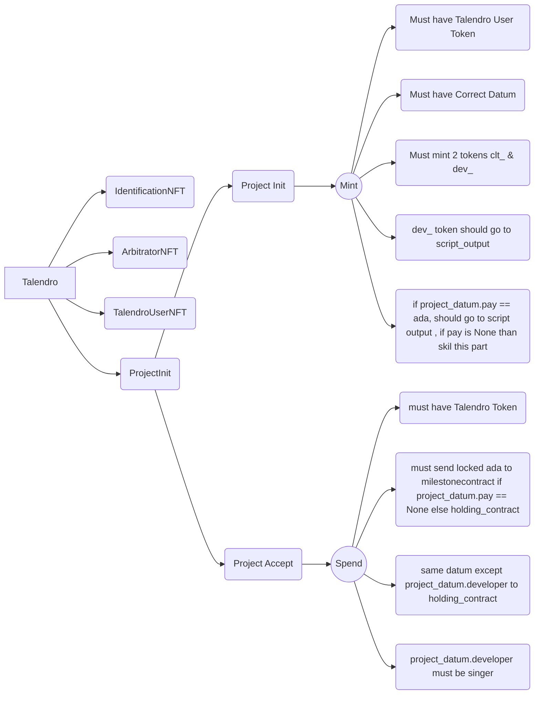

```mermaid
graph LR
    T[Talendro]
    C4mint((Mint))
    C4spend((Spend))
    C1(IdentificationNFT)
    C2(ArbitratorNFT)
    C3(TalendroUserNFT)
    C4(ProjectInit)
    Pinit(Project Init)
    c4c01(Must have Talendro User Token)
    c4c02(Must have Correct Datum)
    c4c03(Must mint 2 tokens clt_ & dev_)
    c4c04(dev_ token should go to script_output)
    c4c05(if project_datum.pay == ada, should go to script output , if pay is None than skil this part)

    c4c11(must have Talendro Token)
    c4c12(must send locked ada to milestonecontract if project_datum.pay == None else holding_contract)
    c4c13(same datum except project_datum.developer to holding_contract)
    c4c14(project_datum.developer must be singer)


    PAct(Project Accept)
    
    T --> C1
    T --> C2
    T --> C3
    T --> C4
    C4 --> Pinit
    Pinit --> C4mint
    C4mint --> c4c01 
    C4mint --> c4c02
    C4mint --> c4c03
    C4mint --> c4c04
    C4mint --> c4c05
    C4spend --> c4c11
    C4spend --> c4c12
    C4spend --> c4c13
    C4spend --> c4c14
    C4 --> PAct
    PAct --> C4spend
```